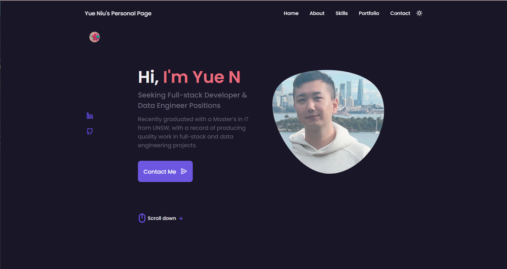

[](https://opensource.org/licenses/MIT)

# Responsive Personal Portfolio Website

A seamless, user-centric, and interactive personal portfolio website, crafted meticulously with HTML, CSS, and JavaScript, accessible at [www.yueniu.me](http://www.yueniu.me).



## Overview

This portfolio website is designed with responsiveness and user experience at its core, presenting a vivid showcase of professional history, skill set, and projects, accompanied by a dynamic theme switcher and engaging animated interactions.

## Features

- **Responsive Web Design (RWD):** Ensures a seamless browsing experience on devices of varied screen sizes.

  

- **Dynamic Theme Switcher:** Enables toggling between light and dark modes, catering to diverse user preferences.

- **Animated Interactions:** Enhances user engagement through interactive UI components and animations.

- **Comprehensive Content Layout:** Presents detailed information about professional journey, skills, project experiences, and contact details.

## Technologies Used

- **HTML:** For structuring the web content.
- **CSS:** For styling and layout, ensuring a visually appealing and responsive design.
- **JavaScript:** For implementing dynamic content and interactions.

## Setup and Deployment

Feel free to use this as a template to design your own website if you like it !!!!!!!

### Prerequisites

Ensure you have the following installed on your machine:

- A modern web browser (e.g., Chrome, Firefox, Safari).
- [Git](https://git-scm.com/)

### Local Setup

1. Clone the repository to your local machine.

```bash
git clone https://github.com/litlcute/responsive_portfolio_website.git
```

2. Navigate to the project directory.
3. Open `index.html` in your preferred web browser to view the website locally.

## License

This project is open source and available under the [MIT License](https://chat.openai.com/c/LICENSE).

## copyright

© Copy from [Bedimcode](https://www.youtube.com/c/Bedimcode)

